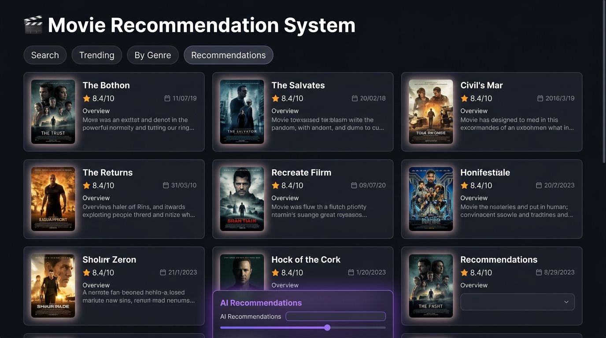

# 🎬 Movie Recommendation System



A Streamlit web app that combines **live TMDB API data** with a **content-based ML recommendation engine** built on the TMDB 5000 dataset.

## Features

| Tab | Description |
|-----|-------------|
| 🔍 Search | Full-text movie search via TMDB API |
| 📈 Trending | Weekly trending movies |
| 🎭 By Genre | Discover movies filtered by genre |
| 🤖 Recommendations | Content-based ML recommendations using genres, keywords, cast & director |

The recommendation engine uses **cosine similarity** over a feature vector ("soup") composed of:
- Genres
- Keywords
- Top 3 cast members
- Director

## Setup

### 1. Clone the repo

```bash
git clone https://github.com/yourusername/Movie-Recommendation-System.git
cd Movie-Recommendation-System
```

### 2. Install dependencies

```bash
pip install -r requirements.txt
```

### 3. Configure your TMDB API key

Get a free API key at [themoviedb.org](https://www.themoviedb.org/settings/api).

Copy the secrets template and add your key:

```bash
cp .streamlit/secrets.toml.example .streamlit/secrets.toml
```

Then edit `.streamlit/secrets.toml`:

```toml
TMDB_API_KEY = "your_api_key_here"
```

Alternatively, set an environment variable:

```bash
export TMDB_API_KEY="your_api_key_here"
```

### 4. Run the app

```bash
streamlit run app.py
```

## Deploying to Streamlit Cloud

1. Push the repo to GitHub (ensure `.streamlit/secrets.toml` is in `.gitignore`).
2. Connect the repo in [Streamlit Cloud](https://streamlit.io/cloud).
3. Add `TMDB_API_KEY` under **Settings → Secrets**.

## Project Structure

```
Movie-Recommendation-System/
├── app.py                          # Streamlit UI
├── recommender.py                  # Content-based ML engine
├── requirements.txt
├── .gitignore
├── .streamlit/
│   └── secrets.toml.example        # API key template
└── datasets/
    ├── tmdb_5000_movies.csv.zip
    └── tmdb_5000_credits.csv.zip
```

## License

MIT © Imaad Mahmood
